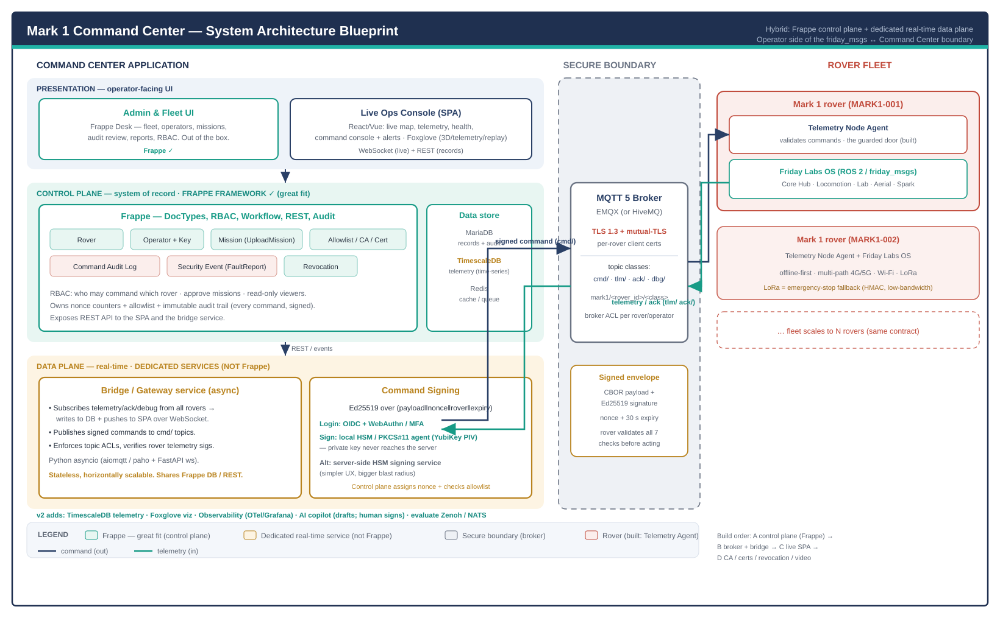

# Mark 1 Command Center — Application Architecture Blueprint

> The operator-facing application that commands and monitors the Mark 1 rover
> fleet. It is the **other end** of the secure boundary already built on the
> rover ([Telemetry Node Agent](../software/Phase 3 - Command Center Boundary.md)):
> internal ROS 2 `friday_msgs` on the rover, signed MQTT-class envelopes on the
> wire, this application for the human.
>
> **Version:** Draft 1.0 · **Status:** design blueprint (no code yet) ·
> 

---

## 1. The one decision everyone asks first: can the backend be Frappe?

**Yes — for the control plane. No — for the real-time data plane. Use both.**

The Command Center has two jobs that pull in opposite directions:

| Job | What it is | Frappe? |
|---|---|---|
| **Control plane** | The system of record: rovers, operators, keys, missions, the command-audit log, security events, allowlists/CA, RBAC, approval workflows, REST API, admin UI. | **✅ Great fit.** This is exactly what Frappe does best — and your home turf. |
| **Data plane** | The live wire: an MQTT broker, thousands of sustained rover connections, telemetry ingested at rate, and the low-latency *command-dispatch* path. | **❌ Not Frappe.** Use a dedicated broker + a thin async bridge service. |

**Why not put the wire in Frappe too?** Frappe is a request/response web framework
(Werkzeug + workers + a socket.io realtime side). It is not an MQTT broker, it
shouldn't hold long-lived rover connections, and running the signing/MQTT loop
inside a web request would bottleneck the safety-relevant command path and couple
it to the request lifecycle. Keep Frappe as the **brain of record**; let a broker
+ bridge handle the **wire**.

The result is a **hybrid**, drawn in the diagram above. The rest of this document
details it.

---

## 2. Three planes

### 2.1 Presentation — what the operator sees
- **Admin & Fleet UI = Frappe Desk** (out of the box): manage rovers, operators,
  missions; review the audit log; run reports; set RBAC. Zero custom frontend.
- **Live Ops Console = a small SPA** (React/Vue): live map (rover positions from
  odometry-derived telemetry), live health/telemetry, the **command console**,
  fault/security alerts, and the debug video stream. It talks **WebSocket** to the
  bridge for live data and **REST** to Frappe for records.

Why split them: Frappe Desk is unbeatable for CRUD/admin and free; a high-rate,
map-and-video live console is better as a purpose-built SPA than fought into Desk.

### 2.2 Control plane — Frappe (system of record)
Model the whole domain as DocTypes:

| DocType | Holds |
|---|---|
| **Rover** | rover_id, TLS cert, firmware, status, last_seen, last-known pose, owner |
| **Operator** | operator_id, Ed25519 public key, role, status |
| **Mission** | the `UploadMission` payload, approval workflow, status |
| **Allowlist / CA / Cert** | which operator keys each rover trusts; cert lifecycle |
| **Command Audit Log** | every command: who, which rover, payload, nonce, signature, accepted/rejected, category — immutable |
| **Security Event** | ingested `FaultReport`s (SECURITY_AUTH / SECURITY_REPLAY …) |
| **Revocation** | revoke-operator records; which rovers have applied them |

Frappe gives you, for free: **RBAC** (who may command which rover, who approves
missions, read-only viewers), **workflow** (mission approval, key provisioning,
revocation), an **immutable audit trail**, **reports/dashboards**, and a **REST
API** the SPA and bridge consume. It also owns the **nonce counters** and the
**allowlist** that the data plane reads.

### 2.3 Data plane — dedicated real-time services (not Frappe)
- **MQTT 5 broker** — **EMQX** recommended (clustering, MQTT 5, TLS 1.3, mTLS,
  per-topic ACLs, rule engine, scale). HiveMQ or a hardened Mosquitto are
  alternatives. This is the messaging backbone every rover connects to.
- **Bridge / Gateway service** — a stateless **Python asyncio** service
  (`aiomqtt`/paho + FastAPI for the WebSocket): subscribes telemetry/ack/debug
  from all rovers → writes to the DB + pushes to the SPA over WebSocket; publishes
  signed commands to `cmd/` topics; enforces topic ACLs; verifies rover telemetry
  signatures. Horizontally scalable; shares Frappe's DB / REST.

---

## 3. Command signing — the security-critical fork

Every command is an **Ed25519 signature over `(payload‖nonce‖rover_id‖expiry)`**
(the contract the rover already enforces). The question is **where the private key
lives**:

- **Recommended — client-side signing.** The operator signs in the browser via
  **WebAuthn / a hardware key (YubiKey-class)** or a local signing agent; the
  private key **never leaves their workstation/HSM** (exactly what the security
  spec demands). The control plane assigns the nonce and checks the allowlist; the
  bridge just relays the already-signed envelope.
- **Alternative — server-side HSM signing service.** A dedicated microservice
  holds operator keys in an HSM and signs on authenticated request. Simpler UX,
  but the server *can* sign — a higher trust assumption and a bigger blast radius
  if breached.

Either way, signing is **not** a Frappe web-request job; it's a client capability
or a dedicated service. This is the main decision to lock before building (§7).

---

## 4. The boundary contract (already built on the rover)

This application speaks the link the [Command Center Protocol Security](../addendums/Command Center Protocol Security.md)
spec defines and the rover's Telemetry agent already validates:

- **Topics:** `mark1/<rover_id>/cmd|tlm|ack|dbg/<class>`.
- **Envelope:** `{ protocol_version, rover_id, sender_id, msg_id, nonce,
  issued_at, expires_at, payload (CBOR), signature (Ed25519) }`.
- **Rover-side checks (done):** protocol major, rover_id, operator allowlist,
  signature, expiry, monotonic nonce → accept or reject-and-log.

So the Command Center is the **producer** of valid envelopes and the **consumer**
of telemetry/acks — no new contract is needed; it mirrors what's verified.

---

## 5. Recommended tech stack

| Layer | Choice |
|---|---|
| Control plane | **Frappe** (Python · MariaDB · Redis) |
| Broker | **EMQX** (MQTT 5 · TLS 1.3 · mTLS · ACL) |
| Bridge | **Python asyncio** (aiomqtt/paho + FastAPI WebSocket) |
| Live UI | **React/Vue SPA** + WebSocket; map (MapLibre/Leaflet); video (WebRTC/HLS) |
| Admin UI | **Frappe Desk** |
| Signing | **client-side WebAuthn/HSM** (recommended) |
| Crypto/encoding | Ed25519 · CBOR (same as the rover) |
| Deploy | Docker / Kubernetes; CA for rover + operator certs |

---

## 6. Deployment & security posture
- **mTLS everywhere** on the broker; per-rover client certs (CN = rover_id),
  per-operator signing keys allowlisted per rover.
- **CA** issues rover/operator certs; root stored offline. Rotation + revocation
  are signed operations (the spec's key-management section).
- **Network:** the broker is the only internet-exposed surface; Frappe + bridge
  sit behind it. Debug stream on a separate topic class + priority.
- **Repo:** the Command Center is its own application — likely its **own repo**
  (`friday-command-center`), deployed separately from the rover OS. This blueprint
  lives with the dossier; the code does not.

---

## 7. Decisions to confirm before building

1. **Signing location** — client-side WebAuthn/HSM (recommended) vs server-side
   HSM service. Changes the operator client and the trust model.
2. **Live UI** — separate SPA (recommended for map/video/real-time) vs push more
   into Frappe Desk + socket.io (less to build, weaker real-time).
3. **Scope of v1** — single rover vs multi-rover fleet from day one (affects RBAC
   + broker ACL design; cheap to design-in now, expensive to retrofit).
4. **Broker** — EMQX (recommended) vs managed MQTT (e.g. HiveMQ Cloud) vs hardened
   Mosquitto.

---

## 8. Phased build plan

| Phase | Deliverable |
|---|---|
| **A — Control plane** | Frappe app: Rover / Operator / Mission / CommandAudit / SecurityEvent / Allowlist DocTypes, RBAC, admin UI, REST. |
| **B — Wire** | EMQX broker + bridge service: telemetry ingest → DB + WebSocket; command publish; ACLs. End-to-end against a real rover (or the sim). |
| **C — Live console** | SPA: map, live telemetry, command console with client-side signing, alerts. |
| **D — Trust + ops** | CA / cert provisioning, revocation workflow, mission upload, debug video, dashboards. |

Each phase ships its own walk-through chapter, same as the rover software.

---

## 9. Honest framing
This is a **design blueprint**, not built code. The rover-side boundary it targets
*is* built and verified ([Phase 3 chapter](../software/Phase 3 - Command Center Boundary.md)).
The numbers and choices here are engineering recommendations to be confirmed at
§7 before implementation begins.

---

**Related:** [Command Center Protocol Security](../addendums/Command Center Protocol Security.md) ·
[Telemetry Command Node](../architecture/Telemetry Command Node.md) ·
[Phase 3 — Command Center Boundary](../software/Phase 3 - Command Center Boundary.md) ·
[Friday Labs OS Architecture](../architecture/Friday Labs OS Architecture.md) ·
[Mark 1 Index](../Mark 1 Index.md)
