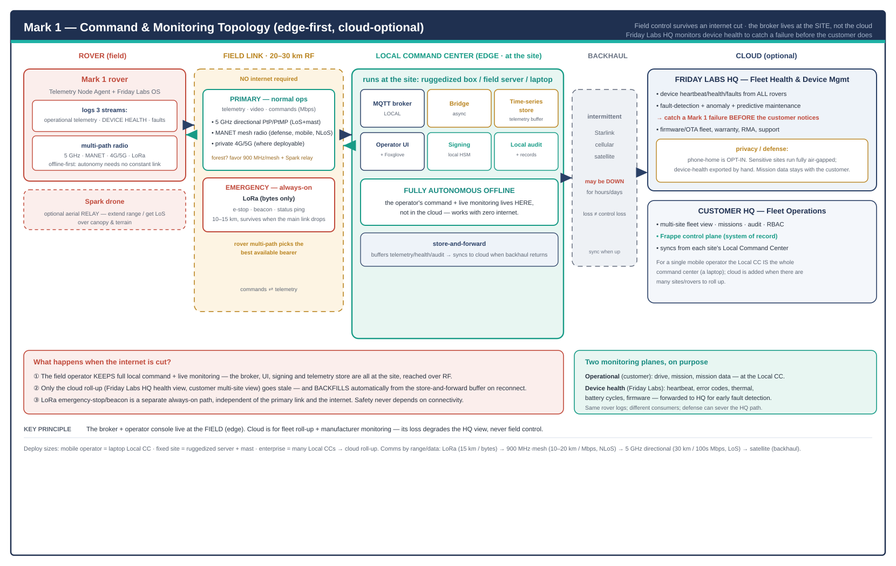

# Command Center — Deployment, Connectivity & Fleet Monitoring

> The blueprint's first draft quietly assumed a cloud broker over the internet.
> For a forest/defense rover that is **offline-first**, that's wrong. This doc
> fixes the topology and closes three gaps: (1) Friday Labs' own device-monitoring
> /fault-detection plane, (2) the 20–30 km field-link comms mode, (3) where the
> Command Center is deployed and what happens when the internet is cut.
>
> **Version:** Draft 1.0 ·  ·
> Companion to the [Command Center Application Blueprint](Command Center Application Blueprint.md).

---

## The one root cause behind all three gaps

> **The command center and the broker must live at the SITE (edge), not in the
> cloud.** Cloud is a *roll-up*, not the control path. Everything below follows
> from this.

This mirrors the rover's own ethos: offline-first, cloud-optional.

---

## Gap 1 — Friday Labs' device monitoring & fault detection

**Requirement (yours):** every rover that ships should still be watched by Friday
Labs' central system — detect a Mark 1 failure *before the customer/beneficiary
notices*, by logging device heartbeat/health.

**The fix — two monitoring planes, on purpose:**

| Plane | Owner | Carries | Lives |
|---|---|---|---|
| **Operational** | Customer / operator | drive, mission, mission data, live telemetry | Local Command Center (the site) |
| **Device health** | **Friday Labs** | heartbeat, error codes, thermal, battery cycles, firmware version, fault reports, uptime | forwarded HQ → **Friday Labs Fleet Health** |

The rover already logs all three streams (operational · device-health · faults —
the `Heartbeat`, `HealthStatus`, `FaultReport` we built). Device-health is
**store-and-forwarded** from the Local CC to **Friday Labs HQ** when backhaul is
available. HQ runs **fault-detection + anomaly detection + predictive
maintenance** and alerts — so Friday Labs sees a degrading motor / thermal creep /
battery fade and opens an RMA *before* the field even calls. It also drives
firmware/OTA fleet management, warranty, and support.

**Defense/privacy is non-negotiable here:** phone-home is **opt-in**. Sensitive
deployments run **fully air-gapped** — device-health stays on-site and is exported
by hand; **mission data never leaves the customer**. The architecture must support
"HQ monitoring on" and "HQ monitoring severed" as a config, per deployment.

This is its own backend at Friday Labs (think a manufacturer's device-management
+ observability cloud — Tesla-watching-its-cars, but opt-in and tenant-isolated).

---

## Gap 2 — The 20–30 km field link: what's the comms mode?

**No single bearer wins** — it's tiered/multi-path. By range vs data rate:

| Bearer | Range | Data rate | Use |
|---|---|---|---|
| **LoRa** (sub-GHz) | 10–15 km | bytes (≈0.3–50 kbps, duty-limited) | **Emergency only:** e-stop, beacon, status ping. Always-on safety path. |
| **900 MHz / 2.4 GHz data radio / MANET mesh** | 10–20 km | Mbps, **NLoS-tolerant**, multi-hop | **Defense + forest:** mobile mesh (Silvus/Rajant/Doodle-class), penetrates terrain, supports moving rovers + relays. |
| **5 GHz directional** (PtP/PtMP, airMAX/LTU-class) | up to ~30 km | 100s of Mbps, **needs line-of-sight + mast** | **Open terrain / fixed site:** telemetry + video + commands at high rate. |
| **Private 4G/5G** | cell-dependent | high | Where a deployable base station / coverage exists. |
| **Satellite** (Starlink/Iridium) | global | Mbps / kbps | **Site backhaul** to cloud, not rover-direct (power/size). |

**Recommendation by use case:**
- **Forest monitoring:** 5 GHz LoS fails through canopy/terrain → favor **900 MHz /
  MANET mesh** + **Spark as an aerial relay** over the canopy; accept lower
  bandwidth and lean on the rover's **offline autonomy** (it doesn't need a fat
  constant link). LoRa for emergency.
- **Defense perimeter (mobile, NLoS, jam-aware):** **MANET tactical mesh** is the
  strong primary (multi-hop, moving nodes, relays); LoRa emergency; optional
  private 5G.
- **Open/agriculture:** **5 GHz directional** with a mast at the operator station
  — simplest high-bandwidth link.

**Key:** the rover's **multi-path radio picks the best available bearer**; the
Local CC's broker is reached over whichever is up. LoRa emergency-stop is a
**separate, always-on path** — safety never depends on the primary link or the
internet.

---

## Gap 3 — Where is it deployed, and what if the cloud link is cut?

**Edge-first, cloud-optional, store-and-forward.**

- **Local / Field Command Center (EDGE):** runs **at the site** on a ruggedized
  box / field server / (for a single mobile operator) a **laptop**. Hosts the
  **local MQTT broker**, the bridge, a **local time-series store**, the **operator
  UI + Foxglove**, **local command signing (HSM)**, and **local audit**. It is
  **fully autonomous offline** — the operator's command + live monitoring lives
  here.
- **Backhaul (intermittent):** Starlink / cellular / satellite — may be down for
  hours/days. The Local CC **buffers** telemetry/health/audit and **syncs** to
  cloud when it returns.
- **Cloud (optional):** **Customer HQ — Fleet Operations** (multi-site roll-up,
  the **Frappe control plane / system of record**, missions, audit, RBAC) and
  **Friday Labs HQ — Fleet Health** (Gap 1). For a single mobile operator the
  Local CC *is* the whole command center; cloud is added only when there are many
  sites/rovers to roll up.

**Internet cut → what survives:**
1. The field operator keeps **full local command + live monitoring** (broker, UI,
   signing, telemetry store are all on-site, reached over RF).
2. Only the **cloud roll-up** (HQ health view, multi-site view) goes stale — and
   **backfills automatically** from the store-and-forward buffer on reconnect.
3. **LoRa e-stop/beacon** is independent of both the primary link and the internet.

So: a cloud outage degrades the *HQ view*, **never field control**. That's the
whole point of putting the broker at the edge.

---

## What this changes in the app blueprint

- The MQTT broker + bridge + a time-series store + operator UI are an **edge
  deployment unit** (the Local CC), replicated per site — not a single cloud
  service.
- **Frappe (control plane)** lives in **cloud** (Customer HQ) and/or as a
  **local Frappe** at larger fixed sites that replicates up; small/mobile
  deployments run edge-minimal and sync to cloud Frappe later.
- A **Friday Labs Fleet Health** backend is added (device-management + anomaly/
  predictive + alerting + OTA/warranty), fed by opt-in store-and-forward.
- **Sync/replication + conflict handling** between edge and cloud becomes a
  first-class concern (telemetry backfill, audit merge, allowlist/revocation
  push-down on reconnect).

---

## Decisions to confirm

1. **Primary field bearer per use case** — MANET mesh (defense/forest) vs 5 GHz
   directional (open) vs private 5G. Drives radio BOM + the ground station.
2. **Edge box class** — laptop (mobile operator) vs ruggedized server (fixed site)
   vs both. Drives whether Frappe runs at the edge.
3. **Friday Labs monitoring policy per deployment** — cloud opt-in vs air-gapped;
   what device-health fields are shareable vs customer-private.
4. **Spark-as-relay** — commit to the aerial-relay role for range/NLoS, or keep
   Spark scouting-only.

---

**Related:** [Command Center Application Blueprint](Command Center Application Blueprint.md) ·
[Command Center Protocol Security](../addendums/Command Center Protocol Security.md) ·
[Telemetry Command Node](../architecture/Telemetry Command Node.md) ·
[Power Budget](../addendums/Power Budget.md) ·
[Mark 1 Index](../Mark 1 Index.md)
